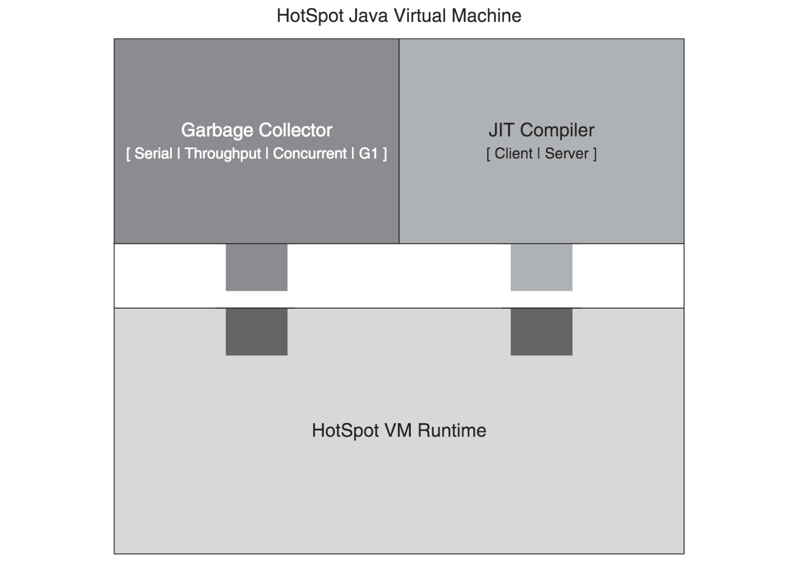

# 16. JVM은 도대체 어떻게 구동될까?

- HotSpot VM은 어떻게 구성되어 있을까?
- JIT Optimizer라는게 도대체 뭘까?
- JRockit의 JIT 컴파일 및 최적화 절차
- IMB JVM의 JIT 컴파일 및 최적화 절차
- JVM이 시작할 때의 절차는 이렇다
- JVM이 종료될 때의 절차는 이렇다
- 클래스 로딩 절차도 알고 싶어요?
- 예외는 JVM에서 어떻게 처리될까?

---

## HotSpot VM은 어떻게 구성되어 있을까?

- HotSpot (Java Hotspot Performance Engine)
- JIT (Just In Time) Compiler (HotSpot)
    - Sun에서 Java 성능을 올리기 위해 개발한 컴파일러
    - HotSpot
    - 프로그램 성능에 영향을 주는 지점을 지속적 분석 -> 동적으로 최적화
- 대부분의 Java가 HotSpot 기반의 VM

### HotSpot VM의 구성



- VM Runtime
    - JIT Compiler API, GC API 제공
    - JVM 시작 런처, 스레드, JNI 관리
- JIT Compiler
- 메모리 관리자

## JIT Optimizer라는게 도대체 뭘까?

- compile : javac compiler를 통해 .class (bytecode) 파일 생성
- JVM은 항상 bytecode로 실행을 시작함
- JIT는 모든 메서드를 컴파일하지 않고 많이 사용되는 메서드만 컴파일
- 초기에 인터프리터로 코드를 시작하고, 코드가 충분히 많이 사용될 경우 compile
- 각 메서드에 2개의 카운터를 두고 통제
    - Invocation Counter (수행 카운터) : 메서드 시작마다 증가
        - 임계값 : `XX:CompileThreshold=3500`
    - Back Edge Counter (백에지 카운터) : 높은 바이트 코드 인덱스에서 낮은 인덱스로 컨트롤 흐름이 변경될 때 증가
        - 메서드에 loop이 존재하는지 확인할 때 사용
        - 수행 카운터보다 컴파일 우선순위가 높음
        - 임계값 = CompileThreshold * OnStackReplacePercentage / 100
            - `XX:OnStackReplacePercentage=80
- 각 카운터들이 인터프리터에 의해 증가할 때마다 임계값을 비교
    - 임계값에 도달하면, 인터프리터가 compile 요청

````
## 메서드가 3만 5천번 호출되면 JIT에서 compile
XX:CompileThreshold=3500
## 백에지 카운터가 2만 8천번 이상이면 JIT에서 compile
XX:OnStackReplacePercentage=80
````

#### 컴파일이 요청되면

- 컴파일 대상 목록 큐에 쌓이고, 인터프리터는 카운터를 리셋하고 메서드 수행을 계속함
    - `-Xbatch` or `-XX:BackgroundCompilation` : 인터프리터가 컴파일때까지 blocking
- 하나 이상의 컴파일러 스레다가 컴파일 대상 목록 큐를 확인
- 컴파일러 스레드가 안바쁠때 하나씩 컴파일

#### 컴파일이 완료되면

- 메서드 호출 시 컴파일된 코드를 실행

#### OSR (On Stack Replacement) compile

- 인터프리터에 의해 수행된 코드 중 가장 오랫동안 루프가 수행되는 부분에 대한 컴파일
- 컴파일이 된상태에서 인터프리터에 의해 최적화되지 않은 상태로 실행되고 있으면,
    - OSR compile을 통해 최적화된 코드 (컴파일된)로 교체

#### Java 5에 추가된 기능

- JVM 시작 시 플랫폼, 시스템 설정을 평가해 자동으로 GC 선정, Heap size, JIT Compiler 설정
- GC가 동적으로 Heap size 조절, New의 Eden, Survivor, Old 영역의 크기 조절
- `-XX:+UseParallelGC`, `-XX:+UseParallelOldGC`

## JRockit의 JIT 컴파일 및 최적화 절차

## IMB JVM의 JIT 컴파일 및 최적화 절차

## JVM이 시작할 때의 절차는 이렇다

1. java 명령어 줄 옵션 parsing
    - 명령들을 HotSpot VM에 전달
2. Java Heap size 할당, JIT compiler 타입 지정 (1번 명령 줄에서 지정 안했을 경우)
    - heap size가 명시적으로 지정되지 않은 경우 알아서 지정함 (HotSpot VM Adaptive Tuning)
3. CLASSPATH, LD_LIBRARY_PATH, PATH 등의 환경변수 설정
4. Main 클래스가 지정되지 않았음녀 , Jar 파일의 manifest 파일에서 Main 클래스를 찾음
5. JNI_CreateJavaVM (JNI 표준 API)로 non-primordial 스레드 생성 -> HotSpot VM 생성 및 초기화
6. Main 클래스가 로딩된 런처에서 main() 메서드 읽음
7. CallStaticVoidMethod()로 네이티브 인터페이스를 불러 HotSpot VM에게 main() 메서드 호출 요청
    - Main 클래스 뒤의 값들 전달

### 5. JNI_CreateJavaVM (JNI 표준 API)로 non-primordial 스레드 생성 -> HotSpot VM 생성 및 초기화

TODO

## JVM이 종료될 때의 절차는 이렇다

- OS `kill` 명령어로 JVM을 종료하면, JVM은 종료 절차를 수행하지 않음

1. HotSpot VM이 작동중이 상횡에서 데몬이 아닌 스레드가 수행 완료할때까지 대기
2. `java.lang.Shutdown` 클래스의 `shutdown()` 메서드 호출, shutdown hook 실행
3. profiler, stat sampler, watcher, garbage collector 스레드 종료
4. `JavaThread::exit()` 호출, HotSpot VM 은 더이상 자바 코드 실행 못함
5. HotSpot VM 스레드 종료, JIT compiler 스레드 종료
6. JNI, HotSpott VM, JVMTI barrier tracing 기능 종료
7. HotSpot vm exit 값 설정
8. 현재 스레드 삭제
9. 입출력 스트림 삭제, PerfMemroy 리소스 연결 해제
10. JVM 종료 호출자로 복귀

## 클래스 로딩 절차도 알고 싶어요?

- loading -> linking -> initialization

1. classpath의 바이너리 자바 클래스 중 로딩할 클래스 탐색
2. 자바 클래스 정의
3. 해당 클래스의 `java.lang.CLass` 객체 생성
4. 링크 : static 필드 생성, 초기화, 메서드 테이블 할당
5. 클래스 초기화
    1. 클래스의 static block, static 필드를 초기화
    2. 부모 클래스 초기화

#### 클래스 로딩시 발생 하는 에러

- `NoClassDefFoundError` : 클래스 파일을 찾을 수 없음
- `ClassFormatError` : 클래스 파일의 포맷이 잘못됨
- `UnsupportedClassVersionError` : 클래스 파일의 버전이 JVM과 맞지 않음
- `ClassCircularityError` : 부모 클래스 로딩 시 문제 발생
- `InCompatibleClassChangeError` : 클래스를 `implements` 하거나 인터페이스를 `extends` 할 때
- `VerifyError` : 클래스 파일의 검증이 실패함

#### class loader delegation

- 클래스 로더가 로딩 시 다른 클래스 로더의 클래스를 로딩하려하는 경우
- 시스템 클래스 로더 : 기본 클래스 로더
    - `main()`이 있는 클래스와 클래스 패스에 있는 클래스들이 속함
- 애플리케이션 클래스 로더 : 시스템 클래스 로더의 하위 클래스 로더
    - 애플리케이션 클래스 로더가 로딩한 클래스들이 속함
    - e.g. 개발자가 임의로 정의, Java SE 기본 라이브러리

### BootStrap Class Loader

- HotSpot VM이 구현
- HotSpot VM이 BOOTCLASSPATH에서 클래스 로딩
- 로딩 대상 : Java SE 클래스 라이브러리 rt.jar

### HotSpot의 클래스 메타데이터

- 클래스 로더가 로딩한 클래스의 메타데이터를 저장하는 공간
- VM Perm 영역에 instanceKlass, arrayKlass 생성
- instanceKlass :  `Java.lang.Class`의 인스턴스, 클래스의 메타데이터를 저장
- klassOop로 instanceKlass에 접근
    - Oop : ordinary object pointer

### 내부 클래스 로딩 데이터의 관리

- 3개의 해시테이블 관리
    - SystemDictionary : 클래스 로더의 이름을 키로 사용
        - key : 클래스 로더의 이름 / 클래스 이름
        - value : klassOop
    - PlaceholderTable : 현재 로딩된 클래스들에 대한 정보 관리
    - LoaderConstraintTable : 클래스 로더의 제약 관리

## 예외는 JVM에서 어떻게 처리될까?

- Java언어의 제약을 어겼을 떄 Exception signal 발생
- 에외 처리 방법
    - 예외를 발생한 메서드에서 잡음
    - 호출한 메서드가 예외를 잠음
- 예외 경우의 수 4가지
    - 경우 1. 던져진 바이트 코드에 의해 초기화
    - 경우 2. VM 내부 호출의 결과로 넘어옴
    - 경우 3. JNI 호출로부터 넘어옴
    - 경우 4. 자바 호출로부터 넘어옴
- VM이 예외가 던져졌다는걸 알면, 예외를 처리할 수 있는 가장 가까운 핸들러를 찾음
    - 현재 메서드, 현재 바이트 코드, 예외 객체 활용
