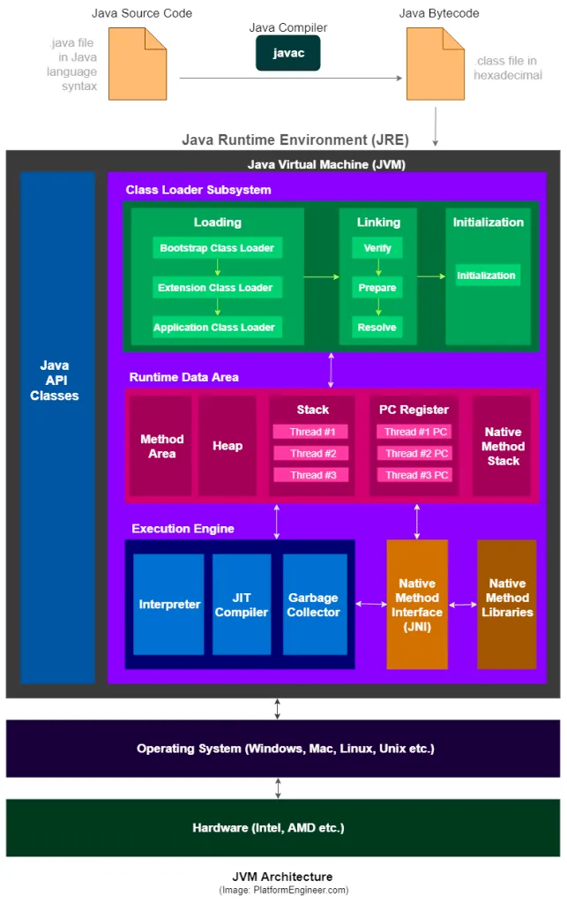

# 17. 도대체 GC는 언제 발생할까?

- GC란?
- 자바의 Runtime data area는 이렇게 구성된다
- GC의 원리
- GC의 종류
- 5가지 GC 방식
- 강제로 GC 시키기

---

- GC 횟수가 많아질수록 응답시간이 느려짐
- Java program의 성능을 생각하려면 GC 처리 방식은 기본으로 알아야함

## GC란?

- GC : Garbage Collection
- GC는 쓰레기 (필요하지 않은데 메모리에 남아있는 객체)를 정리하는 작업

```
public String myCode(){
     String str = "Hello World";
     return str;
}   
```

- `myCode()` 메서드가 호출되면, `str`이라는 변수가 생성되고, "Hello World"라는 문자열이 저장됨
- `myCode()` 메서드가 종료되면, `str`는 쓰레기

## 자바의 Runtime data area는 이렇게 구성된다

- JVM 메모리영역은 Heap과 non-Heap 으로 구분
- Hea 외의 영역은 GC 대상이 아님

### [Java specs](https://docs.oracle.com/javase/specs/jvms/se17/html/jvms-2.html#jvms-2.5)

- The pc Register
- Java Virtual Machine Stacks
- **Heap (GC가 발생하는 영역)**
- Method Area
- Run-Time Constant Pool
- Native Method Stacks

### Heap 메모리

- 클래스 인스턴스, 배열이 쌓임
- 공유(shared) 메모리 : 여러 스레드들이 공유하는 메모리

### non-Heap 메모리

- Java의 내부 처리를 위한 영역
- Method Area
    - Run-Time Constant Pool : 클래스 파일에 있는 실행시 참조하기 위한 정보영역
        - 정보 : 필드, 상수 등
- Java Virtual Machine Stacks : 메서드 호출 정보 frame
    - 지역변수, 임시 결과, 메서드 수행 관련 리턴 정보 등
- Native Method Stacks : Java 외의 언어로 작성된 코드를 위한 stack (보통 C)
    - `StackOverflowError` : 스택이 JVM 스택 영역을 넘어서면 발생
    - `OutOfMemoryError` : 스택의 크기를 늘리려고할 떄, 스레드 생성하려 할떄 메모리 부족 시 발생
- PC Register : JVM 스레드들 각각의 pc register값을 저장하는 영역



출처 : https://medium.com/platform-engineer/understanding-java-memory-model-1d0863f6d973

## GC의 원리

- Garbage Collector가 하는 일
    - 메모리 할당
    - 사용 중인 메모리 인식
    - 사용하지 않는 메모리 인식
- 즉, hang되지 않도록 메모리를 관리하는 것
    - hang : 서버가 요청을 처리하지 못하는 상태, 정체

### Heap 구조

- TODO : 그림
- 크게 Young/Old/Pernament 영역으로 구분
    - Perm은 Java 8부터 없어짐
    - Young : 2 survivor + 1 Eden
- 따라서 고려해야할 Heap 영역은 총 4개 (Young 3개 + Old 1개)

### Young 영역

1. 메모리에 객체생성 : Eden에 생성
2. Eden 꽉참 : Eden에서 GC 발생
    - 살아남은 객체는 survivor a로 이동
    - survivor a와 b 사이의 우선순위는 없음 (반드시 한 쪽은 비어있어야함)
3. survivor a 꽉참 : Survivor a와 Eden에서 GC 발생
    - 살아남은 객체는 survivor b로 이동
4. 2 ~ 3 반복
5. Old로 이동
    - 객체 사이즈가 큰 경우 곧장 Old로 이동 (survivor를 거치지 않음)
        - e.g. survivor 크기가 16MB인데 20MB짜리 객체가 생성되면 바로 Old로 이동

## GC의 종류

- Minor GC : Young 영역에서 발생하는 GC
- Major GC : Old 영역, Perm 영역에서 발생하는 GC
- 성능에 중요한 이유
    - GC가 발생하거나 객체가 다른영역으로 이동할 떄 application에 병목이 발생

## 5가지 GC 방식 (Java 7)

- Serial Collector
- Parallel Collector
- Parallel Compacting Collector
- Concurrent Mark Sweep Collector (CMS)
- Garbage First Collector (G1)
- WAS, Java 설정에서 옵션으로 지정 가능

### Serial Collector

- TODO : 그림
- 대기시간이 많아도 큰 문제가 되지 않는 시스템에서 사용
- `-XX:+UseSerialGC` 옵션으로 사용
- 하나의 CPU로 Young과 Old를 시리얼하게 처리 (연속적으로)
- _Stop-the-world_ : GC 수행 중일 때 application이 멈춤

1. 살아있는 모든 객체는 Eden에 있음
2. Eden 꽉참 : Eden에서 GC 발생
    - 살아남은 객체는 To survivor로 이동 (To survivor : 비어있는 영역)
    - From survivor도 To survivor로 이동
    - 너무 큰 객체는 바로 Old로 이동
3. To survivor가 꽉차면?
    - Eden, From survivor의 객체를 Old로 이동

- 결과 : TODO : 그림

4. Old와 Perm에 있는 객체는 Mark-sweep-compaction 수행
    - Mark : 살아있는 객체를 찾음
    - Sweep : 쓰레기 식별, 제거
    - Compaction : 살아있는 객체를 한 곳으로 모음

- 결과 : TODO : 그림

### Parallel Collector (a.k.a. Throughput Collector)

- CPU의 대기 상태를 최소화 (_stop-the-world_ 시간을 줄임)
- Young 에서의 GC를 병렬로 처리
- 많은 CPU 사용, GC 시간이 짧음, application의 응답시간이 빠름
- `-XX:+UseParallelGC` 옵션으로 사용

### Parallel Compacting Collector

- Parallel Collector와 동일하게 병렬로 처리
- `-XX:+UseParallelOldGC`
- `-XX:+ParallelGCTreads=n` : n개의 스레드로 병렬 처리
- Old 영역에서의 GC는 다음과 같이
    - mark : 살아있는 객체를 식별
    - 종합 : 컴팩션 영역에 살아있는 객체 위치 조사
    - compaction : 살아있는 객체를 한 곳으로 모음 / 나머지는 제거

#### Old에 대한 Serial 과 Parallel Compacting Collector의 비교

- sweep : 단일 스레드가 Old를 탐색
- 종합 : 여러 스레드가 Old를 분리하여 개별 탐색
    - 이전 GC 결과 (컴팩션 영역)도 탐색함

### Concurrent Mark Sweep Collector (a.k.a. low-latency collector)

- Heap 사이즈가 클 때 적합
- 2개 이상의 프로세서 서버에서 적합 (e.g. web server)
- `-XX:+UseConcMarkSweepGC` 옵션으로 사용
- Young에 대해 병렬 GC
- Old에 대한 GC 알고리즘
    - 초기 mark : 매우 짤은 대기시간으로 살아있는 객체 탐색
    - concurrent mark : application과 병렬로 살아있는 객체 탐색
    - remark : concurrent mark 단계에서 변경된 객체애 대해 remark
    - concurrent sweep : application과 병렬로 쓰레기 객체 탐색
- compaction이 없음 (빈 공간이 산재)
- `:CMSInitiatingOccupancyFraction=70` : Old 영역이 70% 차면 GC 수행
- `-XX:+CMSIncrementalMode` : Yong 영역의 GC를 점진적으로 수행
    - 프로세서는 적지만 대기시간을 줄이고싶을 떄 사용

### Garbage First Collector (G1)

- 지금까지 Garbage Collector와 다른 구조 : 바둑판 모양
- region: 바둑판의 한 칸 (default : 1MB, max : 32MB)
- 각 Region이 Eden, Survivor, Old 역할을 번갈아가면서 수행

1. 몇개의 region을 Young으로 지정
2. 객체 생성시 Young region에 저장
3. Young이 꽉차면 GC 수행 -> Survivor로 이동 (이 때 Survivor 영역이 지정됨)
4. 2~3이 반복 (aging) 후 survivor는 Old로 승격

#### Old GC 알고리즘

- initial mark (STW) : Old 영역에서 Survivor로 참조하는 객체 표시
- Root region scanning : Young GC 이전에 Old 영역 참조를 위한 Survivor 영역을 탐색
- Concurrent marking : 전체 Heap에서 살아있는 객체 탐색
- remark (STW) : 힙에 살아있는 객체 표시 작업 완료
    - snapshot at the beginning of remark (SATB) 알고리즘 사용, CMS GC 보다 빠름
- Cleaning (STW) : 쓰레기 객체 제거, 빈 region 초기화
- 복사 (STW) : 살아있는 객체를 빈 region으로 모음

## 강제로 GC 시키기

- `System.gc()` or `Runtime.getRuntime().gc()`
- 절대 사용하지 말것
- GC 방법이 무엇이든 상관 없이 application 전체에 영향을 줌


