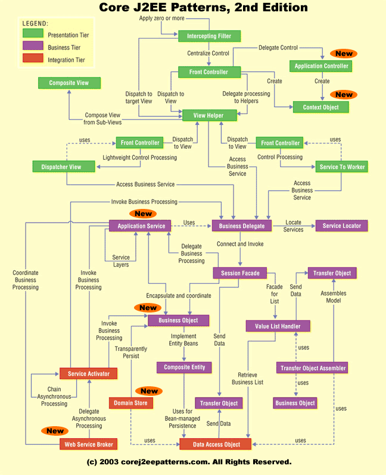

# 1. 디자인 패턴, 꼭 써야 한다

- 적어도 MVC 모델은 적용해야죠
- J2EE 디자인 패턴이란?
- Transfer Object 패턴
- Service Locator 패턴

---

## 적어도 MVC 모델은 적용해야죠

- MVC : Model, View, Controller
- View : 이벤트 발생, 결과를 보여줌
- Controller : View와 Model 연결
- Model : View에서 입력받은 내용을 저장, 관리, 수정

### JSP model 1

- View : JSP
- Controller : JSP
- Model : Java Bean

### JSP model 2

- View : JSP
- Controller : Servlet
- Model : Java Bean

## J2EE 디자인 패턴이란?

  

- Intercepting Filter : 요청 타입에 따라 다른 처리
- Front Controller : 요청 전후 처리를 위한 Controller 지정
- View Helper : Presention 로직과 상관없는 비즈니스 로직을 Helper로 지정
- Composite View : 최소 단위의 하위 컴포넌트를 분리하여 화면 구성
- Service to Worker : Front Controller 와 View Helper 사이에 디스패처를 둠
- Dispatcher View : Front Controller와 View Helper로 디스패치 컴포넌트 형성
    - View 처리가 종료될때까지 다른활동을 지연
- Business Delegate : 비즈니스 서비스 접근 캡슐화
- Service Locator : 서비스, 컴포넌트 검색을 쉽게함
- Session Facade : 비즈니스 로직을 캡슐화하여 원격 클라이언트에서 접근 가능한 서비스로 제공
- Composite Entity : 로컬 Entity Bean 과 POJO를 이용해 큰 단위 Entity를 구성
- Transfer Object : Value Object라고도 함. 데이터 전송을 위한 객체의 패턴
- Transfer Object Assembler : 여러 Transfer Object를 조합, 변형하여 객체를 생성, 사용
- Value List Handler : 데이터 조회 처리, 결과 임시 저장, 결과 집합 검색, 필요한 항목 선택 등을 처리
- Data Access Object : DAO라고도 함. DB 접근 클래스를 추상화, 캡슐화
- Service Activator : 비동기적 호출 처리

## Transfer Object 패턴

- 성능 개선 효과 : 한번에 객체에 여러 값을 담아 올 수 있음

```java
import java.io.Serializable;
import java.util.Optional;

public class Idol implements Serializable { // Serializable 직렬화 가능

    private String name;
    private int age;
    private String groupName;

    public Idol() {
        super();
    }

    public Idol(String name, int age, String groupName) {
        this.name = name;
        this.age = age;
        this.groupName = groupName;
    }

    public String getName() {
        return name;
    }

    public void setName(String name) {
        this.name = name;
    }

    public int getAge() {
        return age;
    }

    public void setAge(int age) {
        this.age = age;
    }

    public String getGroupName() {
        // return groupName == null ? "No Group" : groupName;
        // Java 8 Optional
        return Optional.ofNullable(groupName).orElse("No Group");
    }

    public void setGroupName(String groupName) {
        this.groupName = groupName;
    }

    // Transfer Object 구현시 반드시 구현
    @Override
    public String toString() {
        return "Idol{" +
                "name='" + name + '\'' +
                ", age=" + age +
                ", groupName='" + groupName + '\'' +
                '}';
    }
}

```

## Service Locator 패턴

```java
import javax.naming.InitialContext;
import java.util.Collections;
import java.util.HashMap;
import java.util.Map;

public class ServiceLocator {

    private InitialContext ic;
    private Map cache;
    private static ServiceLocator me;

    static {
        me = new ServiceLocator();
    }

    private ServiceLocator() {
        cache = Collections.synchronizedMap(new HashMap());
    }

    public InitialContext getInitialContext() {
        try {
            if (ic == null) {
                ic = new InitialContext();
            }
        } catch (Exception e) {
            e.printStackTrace();
        }
        return ic;
    }

    public static ServiceLocator getInstance() {
        return me;
    }
}

```

### 정리

- 최소한 Buisniess Delegate, Session Facade, Data Access Object, Service Locator, Transfer Object 패턴은 적용해야함