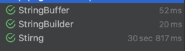
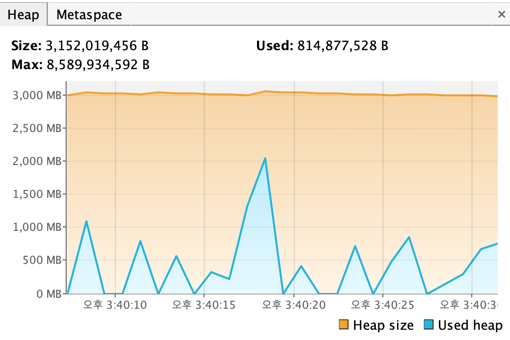
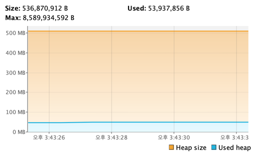

# 3. 왜 자꾸 String을 쓰지 말라는거야

- 클래스를 잘못 사용한 사례
- StringBuffer 클래스와 StringBuilder ㅡㅋㄹ래스
- String vs StringBuffer vs StringBuilder
- 버전에 따른 차이

---

- String 클래스는 잘못 사용하면 메모리에 많은 영향을 줌

## 클래스를 잘못 사용한 사례

```Java
@BenchmarkMode(Mode.AverageTime)
@OutputTimeUnit(TimeUnit.MILLISECONDS)
public class SqlJMH {

    @Benchmark
    public void tst1() {
        String strSQL = "";
        strSQL += "SELECT * ";
        strSQL += "FROM   (SELECT ROWNUM AS RNUM, ";
        strSQL += "               A.* ";
        strSQL += "        FROM   (SELECT * ";
        strSQL += "                FROM   TBL_BOARD ";
        strSQL += "                ORDER  BY BOARD_NO DESC) A) ";
        strSQL += "WHERE  RNUM BETWEEN ? AND ? ";

        // 이하 생략
        
    }
    
    @Benchmark
    public void tst2() {
        StringBuilder strSQL = new StringBuilder();
        strSQL.append("SELECT * ");
        strSQL.append("FROM   (SELECT ROWNUM AS RNUM, ");
        strSQL.append("               A.* ");
        strSQL.append("        FROM   (SELECT * ");
        strSQL.append("                FROM   TBL_BOARD ");
        strSQL.append("                ORDER  BY BOARD_NO DESC) A) ");
        strSQL.append("WHERE  RNUM BETWEEN ? AND ? ");
        

        // 이하 생략

    }
}
```

| 테스트  | 구분      | 결과             |
|------|---------|----------------|
| tst1 | 메모리 사용량 | 10회 약 5MB      |
|      | 응답 시간   | 10회 평균 약 5ms   |
|      |         |                |
| tst2 | 메모리 사용량 | 10회 약 371KB    |
|      | 응답 시간   | 10회 평균 약 0.3ms |

## StringBuffer 클래스와 StringBuilder 클래스

- StringBuffer
    - Thread-safe
- StringBuilder (Java 5 추가)
    - Thread-safe하지 않음

```Java
public class StringBufferTest1 {

    public static void main(String[] args) {
        StringBuilder sb = new StringBuilder();
        sb.append("aespa");
        StringBufferTest1 sbt = new StringBufferTest1();
        sbt.check(sb);

    }

    private void check(CharSequence cs) {
        StringBuffer sb = new StringBuffer(cs);
        System.out.println(sb);
    }
}
```

- `CharSequence`는 인터페이스 (객체 생성 불가능)
    - 구현체 : `String`, `StringBuffer`, `StringBuilder`, ...
    - 구현체 객체를 매개변수로 전달할 떄 사용 (메모리 효율)

```Java
public class StringBufferTest2 {
    public static void main(String[] args) {

        StringBuffer sb = new StringBuffer();
        sb.append("Aespa");
        sb.append(" is Best. ");

        sb.append("karina")
                .append(" is ")
                .append("the best.");

        // not good!
        sb.append("winter" + " is " + "the best.");
    }
}
```

## String vs StringBuffer vs StringBuilder

- String은 `+`연산 시 기존의 String은 GC 대상이 됨
- String으로 append 연산을 많이 하면 Heap에 GC 대상이 쌓임

```Java

package org.tune.three;

import org.junit.jupiter.api.DisplayName;
import org.junit.jupiter.api.Test;

import java.util.Arrays;

public class Tmp {

    @Test
    @DisplayName("Stirng")
    public void test_string() {
        long[] times = new long[10];
        final String aVal = "abcde";
        for (int outLoop = 0; outLoop < 10; outLoop++) {
            long start = System.nanoTime();
            String a = new String();
            for (int i = 0; i < 100000; i++) {
                a += aVal;
            }
            long end = System.nanoTime();
            times[outLoop] = end - start;
        }
        // average time
        System.out.println("av : " + Arrays.stream(times).average().getAsDouble());
    }

    @Test
    @DisplayName("StringBuffer")
    public void test_stringBuffer() {
        long[] times = new long[10];
        final String aVal = "abcde";
        for (int outLoop = 0; outLoop < 10; outLoop++) {
            long start = System.nanoTime();

            StringBuffer a = new StringBuffer();
            for (int i = 0; i < 100000; i++) {
                a.append(aVal);
            }
            long end = System.nanoTime();
            times[outLoop] = end - start;
        }

        System.out.println("av : " + Arrays.stream(times).average().getAsDouble());

    }

    @Test
    @DisplayName("StringBuilder")
    public void test_stringBuilder() {
        long[] times = new long[10];
        final String aVal = "abcde";
        for (int outLoop = 0; outLoop < 10; outLoop++) {
            long start = System.nanoTime();

            StringBuilder a = new StringBuilder();
            for (int i = 0; i < 100000; i++) {
                a.append(aVal);
            }
            long end = System.nanoTime();
            times[outLoop] = end - start;
        }

        System.out.println("av : " + Arrays.stream(times).average().getAsDouble());

    }
}
```



#### String



#### StringBuffer, Builder



### 결론

- String : 짧은 문자열에서 사용
- StringBuffer : Thread-safe이 필요한 환겨에서 사용
    - `static` 변수, singletone 클래스의 멤버일 경우 적합
- StringBuilder : Thread-safe가 필요하지 않은 환경에서 사용

## 버전에 따른 차이

Java 5.0이후에는 컴파일러가 `+`연산을 `StringBuilder`로 변환해서 append 연산을 수행함

### 정리

- JDK 5.0이상이면 StringBuilder로 바꿔줌
- 그러나 루프를 사용해 문자열 더할 시 Heap에 객체는 계속 쌓임
- 루프를 통해 문자열을 완성한다면 Thread-safe이 필요하면 StringBuffer, 아니면 StringBuilder 사용
