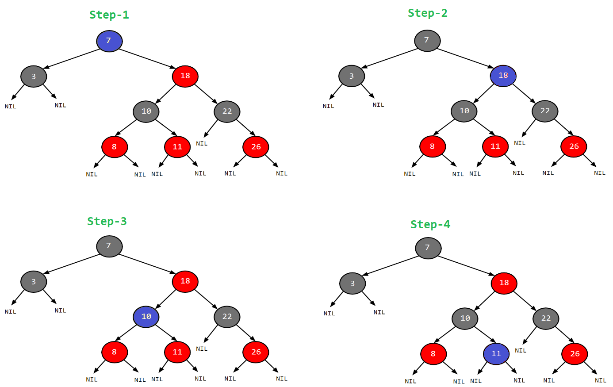

# 4. 어디에 담아야하는지

- Collection 및 Map 인터페이스의 이해
- Set 클래스 중 무엇이 가장 빠를까?
- List 관련 클래스 중 무엇이 가장 빠를까?
- Map 관련 클래스 중 무엇이 가장 빠를까?
- Collection 관련 클래스의 동기화

---

## Collection 및 Map 인터페이스의 이해

- Collection : 상위 인터페이스
- Set : 중복을 허용하지 않는 집합
    - SortedSet : 오름차순 Set
- List : 중복 허용 + 순서 있는 집합
    - 인덱스 사용
    - ArrayList 를 가장 많이 사용
- Queue : FIFO
- Map : Key, Value 쌍으로 이루어진 집합
    - 중복 key 는 허용하지 않음
    - SortedMap : Key 오름차순 정렬

### Set 인터페이스

- HashSet : Hash Table에 데이터를 담음
    - 순서 없음
- TreeSet : Red-Black Tree에 데이터를 담음
    - 오름차순 정렬
    - 데이터를 담으면서 동시에 정렬 (HashSet에 비해 삽입속도 느림)
- LinkedHashSet : HashTable에 데이터를 담음
    - 저장된 순서대로 데이터 정렬

> #### Red-Black Tree
>
> - 이진 트리
> - 각 노드는 검은색 or 빨간색
> - 루트 노드는 검은색
> - 모든 리프 노드는 검은색
> - 붉은 노드의 자식은 검은 노드
> - 모든 말단 노드까지의 경로에는 동일한 수의 검은 노드가 존재

### List 인터페이스 (배열의 확장판)

- 데이터 크기가 자동으로 조절됨
- 데이터 개수를 확실히 모를 때 유용
- Vector : 객체 생성 시 크기 지정 필요 없는 배열
- ArrayList : Vector와 동일한 기능
    - Vector와 차이점 : 동기화 처리가 되어 있지 않음
- LinkedList : ArrayList와 동일, Queue 인터페이스 구현체
    - FIFO

### Map 인터페이스

- Key, Value 쌍으로 이루어진 집합
- Hashtable : Hash Table에 데이터를 담음
    - 동기화
- HashMap : Hash Table에 데이터를 담음
    - 동기화 X
    - null 허용
- TreeMap : Red-Black Tree에 데이터를 담음
    - Key 오름차순 정렬
- LinkedHashMap : Hash Table에 데이터를 담음
    - HashMap과 거의 동일
    - 이중 연결 리스트

### Queue 인터페이스

> #### BlockingQueue
>
> - 고정된 크기의 queue
> - 공간이 부족하면 공간이 생길 때까지 대기

- FIFO
- List는 데이터가 많은 경우 처리 시간이 늘어남
    - index 0을 삭제하면 1 ~ n-1 까지의 데이터를 한 칸씩 앞으로 당겨야 함
- 구현체는 크게 두가지
    - `java.util.LinkedList`, `java.util.PriorityQueue`
    - `java.util.concurrent....`
- PriorityQueue : 삽입 순서와 상관 없이 먼저 생성된 객체가 먼저 나옴
- LinkedBlockingQueue : FIFO
    - 저장 데이터 크기를 선택적으로 지정 가능
    - BlockingQueue
- ArrayBlockingQueue : 저장된 데이터 크기가 고정
    - FIFO
    - BlockingQueue
- PriorityBlockingQueue : 저장 데이터 크기 정해져있지 않음
    - FIFO
    - BlockingQueue
- DelayQueue : 큐가 대기하는 시간을 지정해야함
- SynchronousQueue : 데이터를 저장하지 않고 전달만 함
    - `put()` 호출 시 다른 스레드는 `take()` 호출 시 까지 대기

## Set 클래스 중 무엇이 가장 빠를까?

## List 관련 클래스 중 무엇이 가장 빠를까?

## Map 관련 클래스 중 무엇이 가장 빠를까?

## Collection 관련 클래스의 동기화