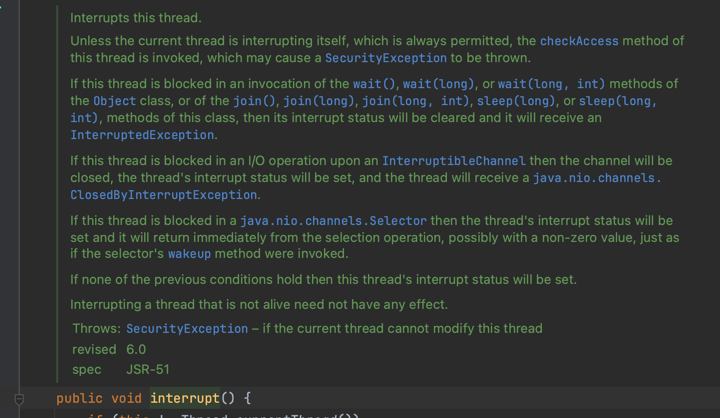

# 8. synchronized는 제대로 알고 써야 한다

- 자바에서 스레드는 어떻게 사용하나?
- `interrupt()` 메서드는 절대적인 것이 아니다.
- synchronized를 이해하자
- 동기화는 이렇게 사용한다 - 동일 객체 접근시
- 동기화는 이렇게 사용한다 - static 사용 시
- 동기화를 위해서 자바에서 제공하는 것들
- JVM 내에서 synchronized는 어떻게 동작할까?

---

## 자바에서 스레드는 어떻게 사용하나?

### 프로세스와 스레드

- 자바 프로세스 : 클래스 수행, was 기동 시 생성되는 Java 프로세스
- 스레드 : 자바 프로세스 안의 1개 이상의 스레드
- 1 : N 관계

### Thread 클래스와 Runnable 인터페이스 구현

- 스레드 구현방법 2가지 : `Thread` 클래스 상속, `Runnable` 인터페이스 구현f
- `Thread` 클래스 상속
    - `Runnable` 구현체
    - 다중 상속 불가능
- `Runnable` 인터페이스 구현
    - 다중 상속 가능 (이미 부모 클래스가 있을 시 유용)
    - 클래스 수행 시 별도의 스레드 객체 생성해야함

````java
public class RunnableImpl implements Runnable {
    public void run() {
        System.out.println("RunnableImpl is running");
    }
}

public class ThreadExtends extends Thread {
    public void run() {
        System.out.println("ThreadExtends is running");
    }
}

public class RunThreads {

    public static void main(String[] args) {
        RunnableImpl runnable = new RunnableImpl();
        ThreadExtends thread = new ThreadExtends();

        new Thread(runnable).start();
        thread.start();
    }

}

````

### `sleep()`, `wait()`, `join()` 메서드

- 실행 중인 스레드 대기상태로 만드는 방법
- 예외를 던짐
- `sleep()` : 명시된 시간만큼 스레드 대기
    - `sleep(long millis)` : 밀리초 단위로 대기
    - `sleep(long millis, int nanos)` : 밀리초 + 나노초 단위로 대기
- `wait()` : 명시된 시간만큼 스레드 대기
    - `Object` 클래스의 메서드
    - 매개변수가 없으면, `notify()` 또는 `notifyAll()` 메서드 호출 시까지 대기
- `join()` : 명시된 시간만큼 스레드 죽기를 기다림
    - 매개변수가 없으면 무한 대기

```java
public class Sleep extends Thread {

    @Override
    public void run() {
        try {
            Thread.sleep(10000); // 10 seconds 대기
        } catch (InterruptedException e) {
            System.out.println("interrupted"); // interrupted : 다른 스레드가 현재 스레드를 중단시킴
        } catch (Exception e) {
            e.printStackTrace();
        }
    }

    public static void main(String[] args) {
        Sleep s = new Sleep();
        s.start(); // 스레드 시작

        int cnt = 0;

        while (cnt < 5) {
            try {
                s.join(1000); // 1 second 대기하면서 thread가 죽기를 기다림
                cnt++;
                System.out.format("%d seconds waited\n", cnt);

                // 스레드가 살아있으면 중단
                if (s.isAlive()) {
                    s.interrupt(); // 스레드 중단
                }
            } catch (InterruptedException e) {
                throw new RuntimeException(e);
            }
        }
    }
}
```

```text
1 seconds waited
interrupted
2 seconds waited
3 seconds waited
4 seconds waited
5 seconds waited
```

## `interrupt()` 메서드는 절대적인 것이 아니다.

```java
// Integer.MIN_VALUE부터 Integer.MAX_VALUE까지 1씩 증가시키는 스레드
public class InfinitThread extends Thread {
    int val = Integer.MIN_VALUE;

    public void run() {
        while (true) {
            val++;

            if (val == Integer.MAX_VALUE) {
                val = Integer.MIN_VALUE;
                System.out.println("MAX_VALUE reached!");
            }
        }
    }
}


public class InterruptSample {

    public static void main(String[] args) throws InterruptedException {

        InfinitThread infinitThread = new InfinitThread();
        infinitThread.start();
        Thread.sleep(2000); // sleep for 2 seconds
        System.out.println("isInterrupted: " + infinitThread.isInterrupted());
        infinitThread.interrupt();
        System.out.println("isInterrupted: " + infinitThread.isInterrupted());
    }
}

```

```text
MAX_VALUE reached!
isInterrupted: false
isInterrupted: true
MAX_VALUE reached!
MAX_VALUE reached!
...
```

- thread interrupt 안됨
- thread가 실행 중 (`run()` 메서드 실행 중)에는 interrupt가 안됨

#### `interrupt()`가 성공적으로 수행되는 경우



- `wait()`, `join()`, `sleep()`으로 인해 blocking 상태인 경우
    - `InterruptedException` 발생
- `InterruptibleChannel` 인터페이스 구현채를 통해 I/O 연산을 수행중인 blocking 상태인 경우
    - `ClosedByInterruptException` 발생
- `Selector` 클래스 사용시 blocking 상태인 경우
    - `ClosedSelectorException` 발생
- 앞의 모든 경우가 아닌 경우

### flag 값 수정하기

```java
public class InfinitThread extends Thread {
    int val = Integer.MIN_VALUE;

    public void run() {
        while (flag) { // flag 값이 true인 경우에만 실행
            val++;

            if (val == Integer.MAX_VALUE) {
                val = Integer.MIN_VALUE;
                System.out.println("MAX_VALUE reached!");
            }
        }
    }

    public void setFlag(boolean flag) {
        this.flag = flag;
    }
}
```

### sleep() 추가하기

```java
public class InfinitThread extends Thread {

    int val = Integer.MIN_VALUE;

    public void run() {
        while (true) {
            val++;

            if (val == Integer.MAX_VALUE) {
                val = Integer.MIN_VALUE;
                System.out.println("MAX_VALUE reached!");
            }

            try {
                Thread.sleep(0, 1); // 1 nanosecond sleep
            } catch (InterruptedException e) {
                break;
            }
        }
    }
}

```

## synchronized를 이해하자

- 동기화 : _천천히 한명씩 들어와!_
- method, block에 사용 가능
    - 생성자, 식별자로는 불가능
- 목적
    - 하나의 객체를 여러 스레드에서 동시 사용하는 경우
    - static 객체를 여러 스레드에서 동시 사용하는 경우

```
public synchronized void method() {
    // ...
}

private Object obj = new Object();
public void sampleBlock(){
    synchronized(obj){
        // ...
    }
}
```

## 동기화는 이렇게 사용한다 - 동일 객체 접근시

```java
/**
 * 기부 재단
 * */
public class Contribution {
    private int amount = 0;

    public void donate() {
        amount++;
    }

    public int getAmount() {
        return amount;
    }
}

/**
 * 기부자
 */
public class Contributor extends Thread {

    private Contribution myContribution;
    private String myName;

    public Contributor(Contribution myContribution, String myName) {
        this.myContribution = myContribution;
        this.myName = myName;
    }

    /**
     * 1000번 기부
     */
    @Override
    public void run() {
        for (int i = 0; i < 1000; i++) {
            myContribution.donate();
        }
        System.out.println(myName + " : " + myContribution.getAmount());
    }
}

public class ContributeTest {

    public static void main(String[] args) {

        Contributor[] contributors = new Contributor[10]; // 기부자 10명

        for (int i = 0; i < 10; i++) {
            contributors[i] = new Contributor(new Contribution(), "기부자" + i);
        }

        // 기부 시작
        for (int i = 0; i < 10; i++) {
            contributors[i].start();
        }

    }
}


```

```text
기부자4 : 1000
기부자3 : 1000
기부자8 : 1000
기부자1 : 1000
기부자7 : 1000
기부자5 : 1000
기부자0 : 1000
기부자9 : 1000
기부자2 : 1000
기부자6 : 1000
```

### 동기화 문제 발생 : `Contribution` 이 하나인 경우

```java
public class ContributeTest {

    public static void main(String[] args) {

        Contributor[] contributors = new Contributor[10]; // 기부자 10명
        Contribution contribution = new Contribution(); // 기부 재단
        for (int i = 0; i < 10; i++) {
            contributors[i] = new Contributor(contribution, "기부자" + i);
        }

        // 기부 시작
        for (int i = 0; i < 10; i++) {
            contributors[i].start();
        }

    }
}


```

```text
기부자5 : 5216
기부자1 : 8216
기부자2 : 3000
기부자0 : 3699
기부자8 : 8216
기부자3 : 4216
기부자4 : 4216
기부자7 : 7216
기부자6 : 6216
기부자9 : 9216
```

```java
/**
 * 기부 재단
 * */
public class Contribution {
    private int amount = 0;

    public synchronized void donate() {
        amount++;
    }

    public int getAmount() {
        return amount;
    }
}

```

```text
기부자5 : 4000
기부자1 : 2000
기부자0 : 1000
기부자3 : 3583
기부자7 : 6780
기부자6 : 6299
기부자8 : 10000
기부자4 : 10000
기부자2 : 10000
기부자9 : 10000
```

- 값은 정확, 성능은 더 떨어짐

## 동기화는 이렇게 사용한다 - static 사용 시

- 가변 데이터를 static으로 사용하는건 매우 위험

```java
/**
 * 기부자
 */
public class Contributor extends Thread {

    private ContributionStatic myContribution;
    private String myName;

    public Contributor(ContributionStatic myContribution, String myName) {
        this.myContribution = myContribution;
        this.myName = myName;
    }

    /**
     * 1000번 기부
     */
    @Override
    public void run() {
        for (int i = 0; i < 1000; i++) {
            myContribution.donate();
        }
        System.out.println(myName + " : " + myContribution.getAmount());
    }
}

/**
 * 기부 재단
 */
public class ContributionStatic {
    private static int amount = 0;

    public static synchronized void donate() {
        amount++;
    }

    public int getAmount() {
        return amount;
    }
}

public class ContributeTest {

    public static void main(String[] args) {

        Contributor[] contributors = new Contributor[10]; // 기부자 10명
        // Contribution contribution = new Contribution(); // 기부 재단
        for (int i = 0; i < 10; i++) {
            contributors[i] = new Contributor(new ContributionStatic(), "기부자" + i);
        }

        // 기부 시작
        for (int i = 0; i < 10; i++) {
            contributors[i].start();
        }

    }
}
```

## 동기화를 위해서 자바에서 제공하는 것들

- `java.util.concurrent` 패키지
- Lock : 실행 중인 스레드를 간단히 정지시켰다 실행, 데드락 회피
- Executors : 스레드 관리 클래스 (스레드 풀 등)
- Concurrent Collections : 동시성 컬렉션 (List, Map 등)
- Atomic Variables : 원자 변수 (변수의 값을 원자적으로 변경)
    - `synchronized` 키워드를 사용하지 않고도 동기화가 보장된 변수 제공

## JVM 내에서 synchronized는 어떻게 동작할까?

- HotSpot VM은 자바 monitor를 제공
    - monitor : 스레드 동기화를 위한 기본 단위 (lock or unlock 둘 중 하나)
    - 상호 배제 프로토콜에 스레드들이 참여하도록 함
    - 동시에 최대 1개의 스레드만 모니터 소유 가능
- `--XX:+UseBiasedLocking` : biased locking 제공
    - adaptive spinning 기술 제공

## 정리

- `synchronized`를 통해 동기화 가능
- 스레드 간에 동일한 객체를 공유하거나, 공유 변수를 사용하면 반드시 사용
- 성능저하 동반
      