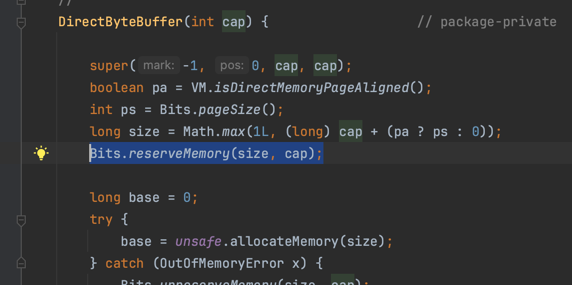
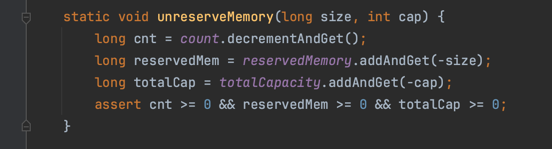
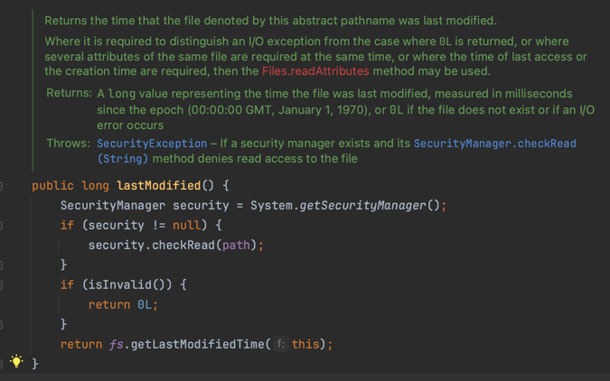

# 9. IO에서 발생하는 병목 현상

- 기본적인 IO는 이렇게 처리한다
- IO에서 병목이 발생한 사례
- 그럼 NIO의 원리는 어떻게 되는 거지?
- DirectByteBuffer를 잘못 사용하여 문제가 발생한 사례
- lastModified() 메서드의 성능 저하

---

## 기본적인 IO는 이렇게 처리한다

### Java에서 IO

- IO : 네트워크, 파일, 다른 서버로부터 데이터 전송, 콘솔 출려 (e.g. `System.out.println()`) 등
- Java에서 입출력은 stream을 통해 이루어짐
- 성능에 가장 영향을 많이 끼침

### 입력 스트림 (`java.io.InputStream`의 하위 클래스)

- `ByteArrayInputStream` : byte 배열로부터 데이터를 읽어들임
- `FileInputStream` : 이미지와 같은 바이너리 기반의 파일을 읽어들임
- `FilterInputStream` : 여러 종류의 유용한 입력 스트림의 추상 클래스
- `ObjectInputStream` : `ObjectOutputStream`으로 저장된 객체를 읽어들임
- `PipedInputStream` : `PipedOutputStream`으로부터 데이터를 읽어들임
- `SequenceInputStream` : 여러 개의 입력 스트림을 하나의 입력 스트림으로 묶어서 읽어들임

### 문자열 기반 입력 스트림 (`java.io.Reader`의 하위 클래스)

- `BufferedReader` : 문자열 입력스트림을 버퍼에 담아서 처리
    - 일반적으로 문자열 기반 파일을 읽을 때 가장 많이 사용
- `CharArrayReader` : 문자 배열로부터 데이터를 읽어들임
- `FilterReader` : 여러 종류의 유용한 문자열 기반 입력 스트림의 추상 클래스
- `FileReader` : 문자열 기반의 파일을 읽어들임
- `InputStreamReader` : 바이트 기반의 입력 스트림을 문자열 기반의 입력 스트림으로 변환
- `PipedReader` : 파이프 스트림을 읽음
- `StringReader` : 문자열을 읽음

### 문자열 기반 파일 읽기

- `FileReader.read()` : 문자 하나를 읽음
- `FileReader.read(char[] cbuf)` : 문자를 배열 크기만큼 읽음
- `BufferedReader.readLine()` : 한 줄을 읽음

```java
package sample.nine;

import org.openjdk.jmh.annotations.*;

import java.io.*;
import java.util.ArrayList;
import java.util.List;
import java.util.concurrent.TimeUnit;

@State(Scope.Thread)
@BenchmarkMode(Mode.AverageTime)
@OutputTimeUnit(TimeUnit.MICROSECONDS)
public class BasicIOReadUtil {

    private String fileName = "테스트할_파일";

    /**
     * 문자열을 글자 하나씩 읽음
     */
    @Benchmark
    public ArrayList readCharStream() {
        ArrayList<StringBuffer> list = new ArrayList<StringBuffer>();
        FileReader fr = null;
        try {
            fr = new FileReader(fileName);
            int data = 0;

            // 한줄 씩 담을 StringBuffer
            StringBuffer sb = new StringBuffer();

            // fr.read() : Reads a single character.
            while ((data = fr.read()) != -1) {
                if (data == '\n') {
                    list.add(sb);
                    sb = new StringBuffer();
                } else {
                    sb.append((char) data);
                }
            }

        } catch (FileNotFoundException e) {
            e.printStackTrace();
            throw new RuntimeException(e);
        } catch (IOException e) {
            e.printStackTrace();
            throw new RuntimeException(e);
        } finally {
            if (fr != null) try {
                fr.close();
            } catch (IOException e) {
                e.printStackTrace();
            }
        }

        return list;
    }

    /**
     * 문자열을 버퍼 크기만큼 읽음
     */
    @Benchmark
    public String readCharStreamWithBuffer() {
        StringBuffer retSB = new StringBuffer();
        FileReader fr = null;

        try {
            fr = new FileReader(fileName);
            int bufferSize = 1024 * 1024;
            char readBuffer[] = new char[bufferSize];
            int resultSize = 0;

            // fr.read(readBuffer) : Reads characters into an array.
            while ((resultSize = fr.read(readBuffer)) != -1) {
                if (resultSize == bufferSize) {
                    retSB.append(readBuffer);
                } else {
                    // 마지막 chunk 처리
                    for (int i = 0; i < resultSize; i++) {
                        retSB.append(readBuffer[i]);
                    }
                }
            }

        } catch (FileNotFoundException e) {
            e.printStackTrace();
            throw new RuntimeException(e);
        } catch (IOException e) {
            e.printStackTrace();
            throw new RuntimeException(e);
        } finally {
            if (fr != null) try {
                fr.close();
            } catch (IOException e) {
                e.printStackTrace();
            }
        }

        return retSB.toString();

    }


    /**
     * 라인 단위로 읽음
     */
    @Benchmark
    public List<String> readBufferReader() {
        List<String> list = new ArrayList<String>();
        BufferedReader br = null;

        try {
            br = new BufferedReader(new FileReader(fileName));
            String data;


            // br.readLine() : Reads a line of text.
            while ((data = br.readLine()) != null) {
                list.add(data);
            }

        } catch (FileNotFoundException e) {
            e.printStackTrace();
            throw new RuntimeException(e);
        } catch (IOException e) {
            e.printStackTrace();
            throw new RuntimeException(e);
        } finally {
            if (br != null) try {
                br.close();
            } catch (IOException e) {
                e.printStackTrace();
            }
        }

        return list;
    }

}

```

```text
Benchmark                                 Mode  Cnt      Score     Error  Units
BasicIOReadUtil.readBufferReader          avgt   10   1710.161 ±  30.626  us/op
BasicIOReadUtil.readCharStreamWithBuffer  avgt   10  10772.087 ± 125.163  us/op
BasicIOReadUtil.readCharStream            avgt   10  55315.293 ± 374.451  us/op
```

- `BufferedReader.readLine()`이 가장 빠름

## IO에서 병목이 발생한 사례

- 사용자 요청 마다 파일 읽기
- 쿼리를 실행 마다 쿼리 파일 읽기

## 그럼 NIO의 원리는 어떻게 되는 거지?

### Java의 파일 읽기가 OS 단에서 수행되는 과정

1. Java 파일 읽기 메서드 호출
2. 파일명을 전달받은 메서드는 OS Kernel에게 파일을 읽어달라고 요청
3. OS Kernel은 파일을 읽어서 Kernel Buffer에 저장 (blocking)
4. JVM으로 데이터 전달 (blocking)
5. JVM에서 메서드에 있는 스트림 관리 클래스를 사용하여 데이터 처리

### NIO (Non-blocking IO)

- 3번 작업을 직접 Java에서 수행
- Buffer, chanel 도입
- 문자열 인코더, 디코더 제공
- Perl 스타일의 정규표현식에 기초한 패턴 매칭 제공
- 파일 잠금, 메모리 매핑이 가능한 파일 인터페이스 제공
- 서버를 위한 복합적인 Non-blocking IO API 제공

## DirectByteBuffer를 잘못 사용하여 문제가 발생한 사례

- NIO 사용시 주로 `ByteBuffer`를 사용
- `ByteBuffer` : 네트워크, 파일에 있는 데이터를 읽어들임
- `wrap()`, `allocate()`, `allocateDirect()` 메서드를 통해 생성
- `allocateDirect()` : OS의 메모리를 직접 사용

```java
import java.nio.ByteBuffer;

/**
 * getDirectBuffer()를 지속적으로 호출하는 클래스
 */
public class DirectByteBufferCheck {

    public static void main(String[] args) {
        DirectByteBufferCheck check = new DirectByteBufferCheck();
        for (int i = 1; i < 1024000; i++) {

            check.getDirectBuffer();

            if (i % 100 == 0) {
                System.out.println("i = " + i);
            }
        }
    }

    public ByteBuffer getDirectBuffer() {
        ByteBuffer buffer;
        buffer = ByteBuffer.allocateDirect(1024 * 1024);
        return buffer;
    }
}

```

```bash
jstat -gcutil {JVM PID} 5s
S0     S1     E      O      M     CCS    YGC     YGCT     FGC    FGCT     CGC    CGCT       GCT   
0.00   0.00   2.00   0.35  77.25  79.95     10     0.017    10     0.055     -         -     0.071
0.00   0.00   2.00   0.35  77.25  79.95     13     0.021    13     0.069     -         -     0.089
0.00   0.00   2.00   0.35  77.25  79.95     17     0.026    17     0.087     -         -     0.114
0.00   0.00   2.00   0.35  77.25  79.95     21     0.031    21     0.105     -         -     0.137
0.00   0.00   2.00   0.35  77.25  79.95     25     0.037    25     0.124     -         -     0.160
0.00   0.00   2.00   0.35  77.25  79.95     29     0.043    29     0.143     -         -     0.186
0.00   0.00   2.00   0.35  77.25  79.95     33     0.050    33     0.160     -         -     0.210
0.00   0.00   2.00   0.35  77.25  79.95     36     0.054    36     0.174     -         -     0.227
```

- FGC 발생
- Old 영역 메모리는 증가하지 않음

### 원인

    


- `DirectByteBuffer` 생성자는 매번 `Bits.unreserveMemory()`를 호출
- `unreserveMemory()` : JVM 할당 메모리보다 더 많은 메모리를 할당하려고 하면 `System.gc()`를 호출
- 권장 : singleton으로 관리 (JVM 내에서 하나만 생성)

````
static void unreserveMemory(long size, int cap) {
    long cnt = count.decrementAndGet(); 
    long reservedMem = reservedMemory.addAndGet(-size);
    long totalCap = totalCapacity.addAndGet(-cap);
    assert cnt >= 0 && reservedMem >= 0 && totalCap >= 0;
}
````

## lastModified() 메서드의 성능 저하

### `lastModified()` 절차

1. `System.getSecurityManager()` : SecurityManager rorcp djedjdha
2. null이 아니면, `SecurityManager.checkRead()` 호출
3. `FileSysytem.lastModified()` 호출

    

### `lastModified()` 대신 `WatchService` 사용

```java
import java.io.IOException;
import java.nio.file.*;
import java.util.Date;
import java.util.List;

import static java.nio.file.StandardWatchEventKinds.ENTRY_CREATE;

public class WatcherThread extends Thread {
    String dirName;

    public WatcherThread(String dirName) {
        this.dirName = dirName;
    }

    public void run() {
        System.out.println("WatcherThread started");
        watchFile();
        System.out.println("WatcherThread ended");
    }

    private void watchFile() {

        Path dir = Paths.get(dirName);
        try {
            WatchService watchService = FileSystems.getDefault().newWatchService();

            dir.register(watchService, java.nio.file.StandardWatchEventKinds.ENTRY_CREATE,
                    java.nio.file.StandardWatchEventKinds.ENTRY_DELETE,
                    java.nio.file.StandardWatchEventKinds.ENTRY_MODIFY);

            WatchKey key;

            for (int i = 0; i < 4; i++) {
                key = watchService.take();
                String watchedTime = new Date().toString();
                List<WatchEvent<?>> events = key.pollEvents();

                events.stream().forEach(event -> {
                    Path name = (Path) event.context();
                    if (event.kind() == java.nio.file.StandardWatchEventKinds.ENTRY_CREATE) {
                        System.out.println("Created: " + name + " " + watchedTime);
                    } else if (event.kind() == java.nio.file.StandardWatchEventKinds.ENTRY_DELETE) {
                        System.out.println("Delete: " + name + " " + watchedTime);
                    } else if (event.kind() == java.nio.file.StandardWatchEventKinds.ENTRY_MODIFY) {
                        System.out.println("Modify: " + name + " " + watchedTime);
                    }
                });

            }

        } catch (IOException e) {
            throw new RuntimeException(e);
        } catch (InterruptedException e) {
            throw new RuntimeException(e);
        }
    }
}

```

```text
WatcherThread started
Modify: 9_IO에서_발생하는_병목_현상 Thu Nov 09 18:50:22 KST 2023
```